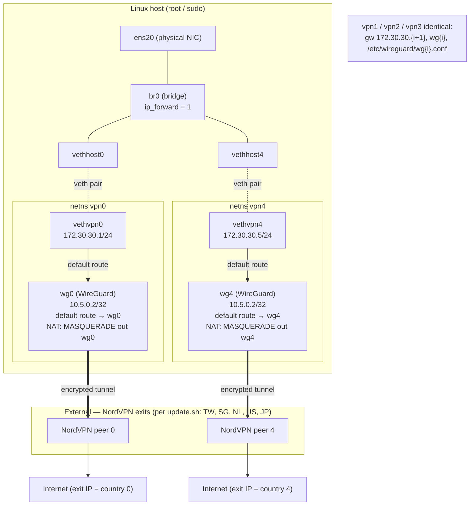

# `vpn.sh` architecture (legacy)

> Reference only — this is the legacy bridge-based design. The final design
> dropped the bridge in favor of routed veth pairs (`src/vpn_namespaces.sh`).

## Overview

`vpn.sh up` creates a "tunnel farm": one `vpn{i}` network namespace per VPN exit
(5 total). Each namespace owns a WireGuard interface (`wg{i}`, config from
`/etc/wireguard/wg{i}.conf`) whose default route sends *all* its traffic into the
encrypted tunnel with NAT masquerade. A `veth` pair bridges each namespace back to
the host's `br0`, which also enslaves the physical NIC `ens20`. Clients reach each
exit by routing to that namespace's gateway IP `172.30.30.{i+1}`.

## Diagram



## ASCII version (single representative namespace)

```
                         HOST (runs as root)
  ┌───────────────────────────────────────────────────────────────┐
  │  ens20 ───┐                                                     │
  │  (phys)   │                                                     │
  │        ┌──┴───────────────── br0 (bridge, ip_forward=1) ─────┐  │
  │        │        │              │              │              │  │
  │     vethhost0  vethhost1   vethhost2   vethhost3   vethhost4 │  │
  │        :          :            :            :          :     │  │
  └────────:──────────:────────────:────────────:──────────:─────┘  │
           : veth     :            :            :          :
  ┌────────:──────────────────────────────────────────────────────┐
  │ netns vpn0                                                      │
  │   vethvpn0  ─ 172.30.30.1/24   (gateway for clients)           │
  │      │                                                          │
  │      │ default route                                           │
  │      ▼                                                          │
  │   wg0 ─ 10.5.0.2/32  ── iptables NAT MASQUERADE out wg0        │
  │      │   (/etc/wireguard/wg0.conf)                             │
  └──────┼─────────────────────────────────────────────────────────┘
         │ encrypted WireGuard tunnel
         ▼
   NordVPN exit (e.g. Taiwan) ──► Internet

   vpn1..vpn4 are identical: gw 172.30.30.{i+1}, wg{i}, wg{i}.conf
```

## Packet flow (egress)

1. Client traffic enters the host on `ens20` → `br0`.
2. Routed to a namespace's gateway `172.30.30.{i+1}` across the
   `vethhost{i}↔vethvpn{i}` pair.
3. Inside `vpn{i}`, the **default route points at `wg{i}`**, so everything enters
   the WireGuard tunnel.
4. `iptables -t nat MASQUERADE` rewrites the source to the tunnel address;
   `FORWARD` accepts from `vethvpn{i}`.
5. Packet exits encrypted to the NordVPN peer, which NATs it to the chosen
   country's public IP.

## Lifecycle commands

| Command | Action |
|---|---|
| `up` | create `br0`, enslave `ens20`, then build 5 namespaces + WG tunnels + veth pairs + NAT |
| `down` | tear down each `wg{i}` and delete `vpn{i}` namespaces |
| `status` | run `wg` inside each namespace |
| `exec <i> <cmd>` | run a command inside `vpn{i}` as the invoking user |

## Notes

- All five tunnels share the same in-tunnel address `10.5.0.2/32`; isolation comes
  entirely from the per-namespace separation.
- WireGuard configs are produced by the legacy `update.sh` (hardcoded sequential
  harvest to `/etc/wireguard/wg0..4.conf`).
